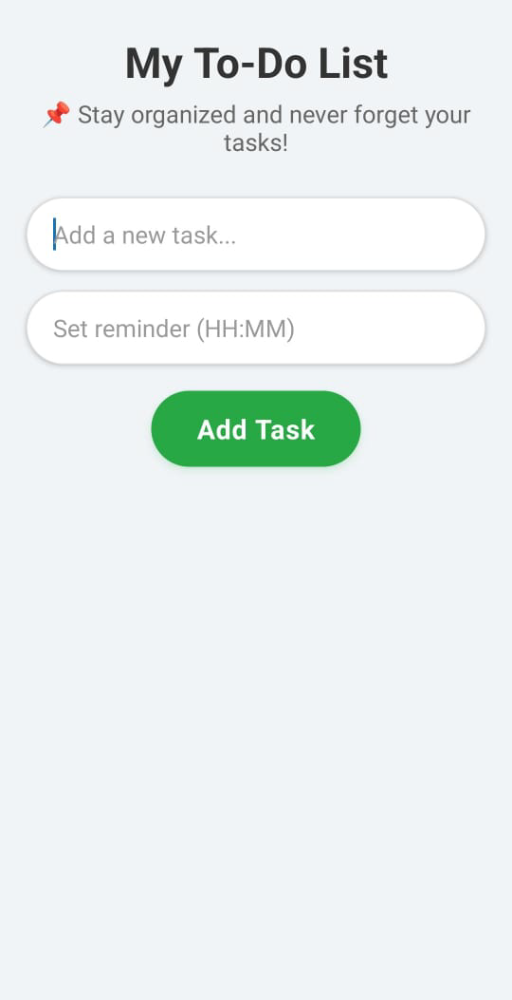
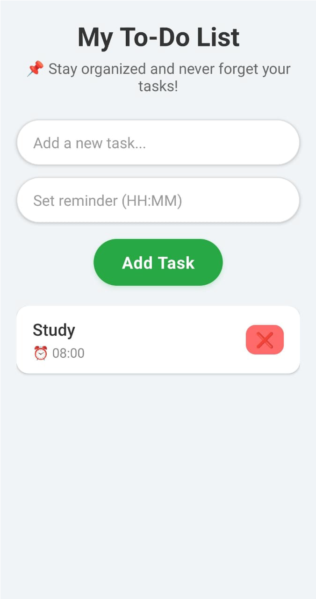

# Welcome to My To-Do List App

A modern React Native To-Do List application built with **Expo**, designed to help you stay organized. Add tasks, set optional reminders, and visually track them with colored indicators.

---

## 🗂️ File Structure

```

To_Do_List/
├── backend/
│   ├── server.js          # Node.js Express backend
│   └── package.json       # Backend dependencies
└── frontend/
├── app/
│   └── index.js       # Main frontend screen
├── App.js             # Expo entry point
├── app.json           # Expo project config
├── package.json       # Frontend dependencies
├── tsconfig.json      # TypeScript config
├── README.md          # Project README
└── screenshots/       # Screenshots for README
├── task-list.png
├── enter-task.png
└── add-task.png

````

---

## 🌟 Features

- **Add Tasks:** Quickly add new tasks to your list  
- **Set Reminders:** Optional time reminders for each task  
- **Delete Tasks:** Remove tasks individually  
- **Stylish UI:** Rounded inputs, buttons, and cards with shadows  
- **Keyboard Friendly:** Input adjusts with keyboard using `KeyboardAvoidingView`  

---

## 📱 Screenshots

  
  
  

---

## Setup and Installation

### Prerequisites

- Node.js (v16 or higher)  
- npm or yarn  
- Expo CLI:  
npm install -g expo-cli

### Backend Setup

cd backend
npm install
node server.js
```

The server will run on [http://localhost:3000](http://localhost:3000)

### Frontend Setup

cd frontend
npm install
npx expo start
```

---

## 🚀 Usage

1. Open the app in Expo Go or emulator.
2. Enter a task in **“Add a new task”** field.
3. Optionally, set a reminder in **“Set reminder (HH:MM)”** field.
4. Press **Add Task**.
5. Delete a task by pressing the ❌ button.

---

## Platform-specific Backend URL

* **Android Emulator:** `http://10.0.2.2:3000`
* **iOS Simulator:** `http://localhost:3000`
* **Web/Other:** `http://localhost:3000`

> Modify the backend URL in `app/index.js` if needed.

---

## 🌈 Future Improvements

* Task completion toggle (complete/incomplete)
* Swipe-to-delete functionality
* Push notifications for reminders
* Persist tasks using a database (MongoDB / SQLite)
* Dark mode support

---

## Troubleshooting

* **Backend not connecting:** Ensure backend server is running on port 3000
* **Port already in use:** Kill Node.js processes:

```bash
taskkill /F /IM node.exe
```

* **Expo CLI issues:** Clear cache:

```bash
npx expo start --clear
```

---

## Development Notes

* **Frontend:** React Native components in `app/`
* **Backend:** Express.js server with in-memory storage (for demo)
* **Styling:** React Native StyleSheet API
* Extend backend API in `backend/server.js`
* Modify frontend design in `app/index.js`

---

## Technologies Used

* **Frontend:** React Native, Expo
* **Backend:** Node.js, Express.js, CORS
* **Development:** Expo CLI, npm

---

## License

This project is for **educational purposes**.
